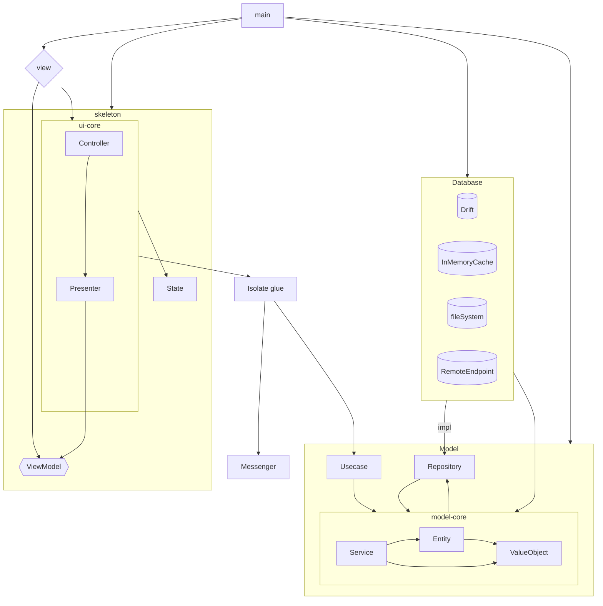

# 1. Index

- [1. Index](#1-index)
- [2. overall structure](#2-overall-structure)
- [3. Model](#3-model)
	- [3.1. Usecase](#31-usecase)
		- [3.1.1. ticket data managing](#311-ticket-data-managing)
		- [3.1.2. ticket fetching](#312-ticket-fetching)
		- [3.1.3. event existence checking](#313-event-existence-checking)
		- [3.1.4. category managing](#314-category-managing)
		- [3.1.5. currency managing](#315-currency-managing)
		- [3.1.6. chart making](#316-chart-making)
	- [3.2. Model-core](#32-model-core)
		- [3.2.1. Entity](#321-entity)
			- [3.2.1.1. Category](#3211-category)
			- [3.2.1.2. Currency](#3212-currency)
			- [3.2.1.3. ReceiptLog](#3213-receiptlog)
			- [3.2.1.4. Plan](#3214-plan)
			- [3.2.1.5. EstimationScheme](#3215-estimationscheme)
			- [3.2.1.6. MonitorScheme](#3216-monitorscheme)
			- [3.2.1.7. Ticket](#3217-ticket)
		- [3.2.2. Value-Object](#322-value-object)
			- [3.2.2.1. Date](#3221-date)
			- [3.2.2.2. Period](#3222-period)
			- [3.2.2.3. Price](#3223-price)
			- [3.2.2.4. Schedule](#3224-schedule)
				- [3.2.2.4.1. OneshotSchedule](#32241-oneshotschedule)
				- [3.2.2.4.2. IntervalSchedule](#32242-intervalschedule)
				- [3.2.2.4.3. WeeklySchedule](#32243-weeklyschedule)
				- [3.2.2.4.4. MonthlySchedule](#32244-monthlyschedule)
				- [3.2.2.4.5. AnnualSchedule](#32245-annualschedule)
			- [3.2.2.5. DisplayConfig](#3225-displayconfig)
				- [3.2.2.5.1. MonitorDisplayConfig](#32251-monitordisplayconfig)
				- [3.2.2.5.2. EstimationDisplayConfig](#32252-estimationdisplayconfig)
			- [3.2.2.6. ReceiptRecord](#3226-receiptrecord)
			- [3.2.2.7. EventExistence](#3227-eventexistence)
			- [3.2.2.8. Collection](#3228-collection)
				- [3.2.2.8.1. CategoryCollection](#32281-categorycollection)
				- [3.2.2.8.2. CurrencyCollection](#32282-currencycollection)
				- [3.2.2.8.3. RecordCollection](#32283-recordcollection)
				- [3.2.2.8.4. ReceiptLogCollection](#32284-receiptlogcollection)
				- [3.2.2.8.5. TicketCollection](#32285-ticketcollection)
		- [3.2.3. Service](#323-service)
			- [3.2.3.1. InitializationService](#3231-initializationservice)
			- [3.2.3.2. EventExistenceCheckingService](#3232-eventexistencecheckingservice)
			- [3.2.3.3. EstimationService](#3233-estimationservice)
			- [3.2.3.4. MonitorService](#3234-monitorservice)
			- [3.2.3.5. ExternalDataService](#3235-externaldataservice)
			- [3.2.3.6. ErrorHandlingService](#3236-errorhandlingservice)
	- [3.3. Repository](#33-repository)
		- [3.3.1. PrimitiveDataRepositories](#331-primitivedatarepositories)
			- [3.3.1.1. Commands](#3311-commands)
			- [3.3.1.2. Queries](#3312-queries)
			- [3.3.1.3. non-RDB](#3313-non-rdb)
		- [3.3.2. CacheDataRepository](#332-cachedatarepository)
- [4. Skeleton](#4-skeleton)
	- [4.1. PlanningPage](#41-planningpage)
	- [4.2. MainPage](#42-mainpage)
	- [4.3. DataPage](#43-datapage)
	- [4.4. UtilPage](#44-utilpage)
- [5. Isolate glue and Messenger](#5-isolate-glue-and-messenger)
- [6. View and Database](#6-view-and-database)
- [7. main (entry point)](#7-main-entry-point)
- [8. External Interaction](#8-external-interaction)
	- [8.1. format of backup file](#81-format-of-backup-file)
	- [8.2. format of csv file](#82-format-of-csv-file)
- [9. Error Handling](#9-error-handling)
- [10. Test Strategy](#10-test-strategy)
	- [10.1. unit test](#101-unit-test)
	- [10.2. joint test](#102-joint-test)
	- [10.3. integration test](#103-integration-test)
	- [10.4. system test](#104-system-test)

# 2. overall structure

dependency flow



- **main**
	- entry point
- **View**
	- Made with `flutter` (Widgets).
- **Skeleton**
	- Purely made with `dart`, without using `flutter` or any external libraries.
	- Skeleton should not be affected by the view.
	- **Controller**
		- Listens to UI events and interacts with the Model (through `Isolate glue`).
		- Calls the Model to store data (through `Isolate glue`).
	- **Presenter**
		- Provides data as ViewModel (final-object) to the view.
		- Defines the page structure, specifying what data should be shown and stored.
	- **State**
		- Used for Controller and Presenter to cooperate.
- **Isolate glue**
	- A layer to connect the Model and Skeleton, ensuring an async-gap between them.
	- Based on the Isolate feature of `flutter`.
	- **Messenger**
		- Used by 'Isolate glue'. Since only primitive data can be transmitted across Isolates, the Messenger converts string data into objects and vice versa using `json` format.
- **Model**
	- Purely made with `dart`, without using `flutter` or any external libraries.
	- **Usecase**
		- Defines use cases and provides them as functions or static methods.
	- **Model-core**
		- The most central part of this software.
	- **repository**
		- declares the functions that the Database should provide.
- **Database**
	- Supports data perpetuation and caching.

# 3. Model

## 3.1. Usecase

### 3.1.1. ticket data managing

Client needs to manage the data of tickets.

|   method   | LogTicket        | PlanTicket | EstimationTicket       | MonitorTicket       |
| :--------: | ---------------- | ---------- | ---------------------- | ------------------- |
| **create** | createReceiptLog | createPlan | createEstimationScheme | createMonitorScheme |
|  **edit**  | editReceiptLog   | editPlan   | editEstimationScheme   | editMonitorScheme   |
| **delete** | deleteReceiptLog | deletePlan | deleteEstimationScheme | deleteMonitorScheme |

- The `create` method returns the ID of the newly created entity. It takes primitive parameters to create the entity.
- The `edit` method returns nothing. It takes the ID of the entity as a parameter in addition to the parameters of the `create` method.
- The `delete` method returns nothing. It only takes the ID of the entity as a parameter.

As to `LogTicket`, it needs `Preset`s. Those provides default `category` and default `description` based on recent ReceiptLogs.

To configure the ticket data, all categories and all currencies are necessary. Additionally, a default currency should be supplied.

|      method      | category           | currency             |
| :--------------: | ------------------ | -------------------- |
|   **fetchAll**   | fetchAllCategories | fetchAllCurrencies   |
| **fetchDefault** |                    | fetchDefaultCurrency |

### 3.1.2. ticket fetching

The client needs to fetch ticket data.

- **fetchTicketsOn**(date): tickets
	- Returns tickets that match the following criteria:
		- ReceiptLog with a date identical to the parameter date.
		- Plan with a schedule that contains the parameter date.
		- Estimation whose scheme has a period that contains the parameter date.
		- Monitor whose scheme has a period that contains the parameter date.
- **fetchReceiptLogsAndMonitorsForToday**(): tickets
	- Returns tickets that match the following criteria:
		- ReceiptLog with a date within the last two days.
		- ReceiptLog that is not confirmed.
		- Monitor whose scheme has a period that contains the current date.
- **fetchReceiptLogs**(limit of record, offset): receipt logs
	- Returns the most recent logs for review and modification.
	- The limit is the maximum number of logs to return. The offset is the number of logs to skip.

### 3.1.3. event existence checking

Client needs to check event existence of some date to preview the state.

- **fetchEventExistenceOn**(date): EventExistence
	- The detail of  `EventExistence` is written below.

### 3.1.4. category managing

(described below with `currency managing`)

### 3.1.5. currency managing

The client needs to create, integrate, and rename categories. To list all categories, use `fetchAllCategories`.

Additionally, the client needs to create, integrate, and rename currencies, and update the currency ratios. To list all currencies, use `fetchAllCurrencies`.

|      method      | Category             | Currency             |
| :--------------: | -------------------- | -------------------- |
|    **create**    | makeCategory         | makeCurrency         |
|     **save**     | saveCategory         | saveCurrency         |
|  **integrate**   | integrateCategory    | integrateCurrency    |
| **setAsDefault** | setCategoryAsDefault | setCurrencyAsDefault |

- The `create` method creates a new category and returns the ID of the newly created category.
- The `save` method edits an existing entity. It requires the ID of the entity in addition to the parameters of the `create` method.
- The `integrate` method takes `replaceeId` and `replacerId`. It replaces an entity whose ID is `replaceeId` with an entity whose ID is `replacerId`.
- The `setAsDefault` method sets the default entity. There should be exactly one default entity.

### 3.1.6. chart making

Client need to get values to make a chart.

- **getValuesOfPieChart**(currency, period, array of category collection): array of (category collection, total amount)
	- returns ratio of total amount during the period of each group. A single category collection express a single category group.
- **getValuesOfAccumulationChart**(currency, analysis period, viewport period, array of category collection, interval): array of (date, accumulated amount)
	- returns accumulation(total) of price until corresponding the date within viewport period.
	- Interval is a duration no less than a day (the finest unit is a day). `interval` is an interval between two succeeding dates.
	- Only records within analysis periods are counted on accumulation.
- **getValuesOfSubtotalChart**(currency, viewport period, array of category collection, interval): array of (date, subtotal amount)
	- returns subtotal of price within viewport period.
	- Interval is a duration no less than a day (the finest unit is a day). `interval` is an interval between two succeeding dates.
		- If the interval is grater than a day, it returns subtotals of a period between the day and the day before duration of interval.

## 3.2. Model-core

Model-core is made up with Entities, Value-Objects and Services.
all fields of all classes in this layer are basically read-only.

```mermaid
classDiagram

namespace service {
	class EventExistenceCheckingService {
		+eventExistenceOn(date: Date) EventExistence
	}
	class InitializationService {
		+putDefaultCategory() CategoryCollection
		+putDefaultCurrency() CurrencyCollection
	}
	class EstimationService {
		+estimateForCategory(category: Category) Price
		+estimateForScheme(scheme: EstimationScheme) Price
	}
	class MonitorService {
		+valueForScheme(scheme: MonitorScheme) Price
	}
	class ReceiptLogPresetService {
		+presets() (Category, string)
	}
	class ExternalDataService {
		+backup(path: string)
		+restore(path: string)
		+export(path: string)
		+import(path: string)
		+overwrite(path: string)
	}
	class ErrorHandlingService{
		+logError(error_message: string)
	}
}
EventExistenceCheckingService-->EventExistence
EventExistenceCheckingService-->Date
InitializationService-->CategoryCollection
InitializationService-->CurrencyCollection
EstimationService-->Category
EstimationService-->EstimationScheme
EstimationService-->Price
MonitorService-->MonitorScheme
MonitorService-->Price
ReceiptLogPresetService-->Category
ReceiptLogPresetService-->ReceiptLogCollection

namespace entity {
	class Category {
		-id: string
		+name: string

		+rename(newName: string) void
		+integrateWith(otherCategory: Category) void

		+setAsDefault() void

		+new(name) Category$
		+as(id, name) Category$
	}
	class Currency {
		-id: string
		+name: string
		+ratio: double

		+rename(newName: string) void
		+setRatio(newRatio: string) void

		+setAsDefault() void

		+new(name, ratio) Currency$
		+as(id, name, ratio) Currency$
	}
	class Ticket {
		<<facade>>
		+?plan: Plan
		+?estimation: EstimationScheme
		+?log: ReceiptLog
		+?monitor: MonitorScheme

		+delete() void
	}
	class EstimationScheme {
		-id: string
		+period: Period
		+category: Category
		+displayConfig: EstimationDisplayConfig

		+setPeriod(period: Period) void
		+setCategory(category: Category) void
		+setDisplayConfig(displayConfig: EstimationDisplayConfig) void
		+delete() void

		+new(period, category, displayConfig) EstimationScheme$
		+as(id, period, category, displayConfig) EstimationScheme$
	}
	class ReceiptLog {
		-id: string
		+date: Date
		+price: Price
		+description: string
		+category: Category
		+confirmed: bool

		+setDate(date: Date) void
		+setPrice(price: Price) void
		+setDescription(description: string) void
		+setCategory(category: Category) void
		+confirm() void
		+delete() void

		+new(date, price, description, category, initiallyConfirmed: bool) ReceiptLog$
		+as(id, date, price, description, category, initiallyConfirmed: bool) ReceiptLog$
	}
	class MonitorScheme {
		-id: string
		+period: Period
		+displayConfig: MonitorDisplayConfig
		+categories: CategoryCollection

		+setPeriod(period: Period) void
		+setDisplayConfig(displayCondig: MonitorDisplayConfig) void
		+setCategories(categories: CategoryCollection) void
		+delete() void

		+new(period, displayConfig, categories) MonitorScheme$
		+as(id, period, displayConfig, categories) MonitorScheme$
	}
	class Plan {
		-id: string
		+schedule: Schedule
		+price: Price
		+description: string
		+category: Category

		+setSchedule(schedule: Schedule) void
		+setPrice(price: Price) void
		+setDescription(description: string) void
		+setCategory(category: Category) void
		+delete() void

		+new(schedule, price, description, category) Plan$
		+as(id, schedule, price, description, category) Plan$
	}
}

Ticket *-- Plan
Ticket *-- EstimationScheme
Ticket *-- ReceiptLog
Ticket *-- MonitorScheme

Plan o-- Category
EstimationScheme o-- Category
ReceiptLog o-- Category
MonitorScheme o-- CategoryCollection

namespace valueObject {
	class Price {
		+amount: int
		+currency: Currency
		+excahnge(newCurrency: Currency) Price
		+new(amount, currency) Price$
		+default() Price$
	}

	class Date {
		+year: int
		+month: int
		+day: int
		+applyOffset(yearDelta, monthDelta, dayDelta) Date
		+new(year, month, day) Date$
		+today() Date$
		+farPast() Date$
	}
	class Period {
		+begins: Date
		+ends: Date
		+periodIsIn(otherPeriod: Period) bool
		+dateIsIn(date: Date) bool
		+new(begins, ends) Period$
		+withOffset(origin:Date, offset:int) Period$
	}

	class Schedule {
		<<facade>>
		+?oneshot
		+?interval
		+?weekly
		+?monthly
		+?annual
		+isInSchedule(date: Date) bool
	}
	class OneshotSchedule {
		+origin: Date
		+isInSchedule(date: Date) bool
		+new(origin: Date) OneshotSchedule$
	}
	class IntervalSchedule {
		+origin: Date
		+period: Period
		+interval: int
		+isInSchedule(date: Date) bool
		+new(origin, period, interval): IntervalSchedule$
		+everydayDuring(period): IntervalSchedule$
	}
	class WeeklySchedule {
		+sunday: bool
		+monday: bool
		+tuesday: bool
		+wednesday: bool
		+thursday: bool
		+friday: bool
		+saturday: bool
		+period: Period
		+getWeekdayList() int[]
		+isInSchedule(date: Date) bool
		+new(sunday, monday, tuesday, wednesday, thursday, friday, saturday, period) WeeklySchedule$
	}
	class MonthlySchedule {
		+offset: int
		+period: Period
		+new(offset, period) MonthlySchedule$
	}
	class AnnualSchedule {
		+origin: Date
		+period: Period
		+new(origin, period) AnnualSchedule$
	}

	class MonitorDisplayConfig {
		<<enumeration>>
		Sum
		Mean
		QartileMean
	}
	class EstimationDisplayConfig {
		<<enumeration>>
		PerDay
		PerWeek
		PerMonth
		PerYear
	}

	class EventExistence {
		<<enumeration>>
		nothing
		trivial
		important
	}

	class ReceiptRecord {
		+date: Date
		+price: Price
		+category: Category

		+new(date, price, category) ReceiptRecord$
	}

	class CategoryCollection {
		-isSelectingAll: bool
		+asList() List~Category~
		+asStream() Stream~Category~
		+allCategories() CategoryCollection$
		+from(Iterable~Category~) CategoryCollection$
	}
	class CurrencyCollection {
		-isSelectingAll: bool
		+asList() List~Currency~
		+asStream() Stream~Currency~
		+allCurrencies() CurrencyCollection$
	}
	class ReceiptLogCollection {
		+asList() List~ReceiptLog~
		+asStream() Stream~ReceiptLog~
		+allLogs() ReceiptLogCollection$
	}
	class RecordCollection {
		+asList() List~ReceiptRecord~
		+asStream() Stream~ReceiptRecord~
		+recordsBetween(period: Period) RecordCollection$
	}
	class TicketCollection {
		+asList() List~Ticket~
		+asStream() Stream~Ticket~
		+ticketsOn(date: Date) TicketCollection$
	}
}
OneshotSchedule *-- Date
IntervalSchedule *-- Date
IntervalSchedule *-- Period
WeeklySchedule *-- Period
MonthlySchedule *-- Period
AnnualSchedule *-- Date
AnnualSchedule *-- Period

Schedule *-- OneshotSchedule
Schedule *-- IntervalSchedule
Schedule *-- WeeklySchedule
Schedule *-- MonthlySchedule
Schedule *-- AnnualSchedule

Price o-- Currency
Plan *-- Price
Period *-- Date

ReceiptLog *-- Date
ReceiptLog *-- Price
ReceiptRecord *-- Date
ReceiptRecord *-- Price
MonitorScheme *-- Period
MonitorScheme *-- MonitorDisplayConfig
EstimationScheme *-- Period
EstimationScheme *-- EstimationDisplayConfig
Plan *-- Price
Plan *-- Schedule

RecordCollection --> ReceiptRecord
CategoryCollection --> Category
CurrencyCollection --> Currency
ReceiptLogCollection --> ReceiptLog
TicketCollection --> Ticket

ReceiptRecord ..o Plan
ReceiptRecord ..> EstimationScheme
ReceiptRecord ..o ReceiptLog
ReceiptRecord o-- Category
```



### 3.2.1. Entity

#### 3.2.1.1. Category

Each ReceiptLog should come with a single category.

`Category` consists of:

- `id`
- `name`

`Category` is used to classify expenses. It is used to create `Monitor` content, chart content, and more.

#### 3.2.1.2. Currency

`Currency` is a part of `Price`.

`Currency` consists of:

- `id`
- `ratio`: The `ratio` is used when exchanging the currency of a `Price`. For instance, if a price is (amount: 100, currency: currency-A) and currency-A has a ratio of `2.0`, the price is equivalent to (amount: 150, currency: currency-B) if currency-B has a ratio of `3.0`.
- `name`

#### 3.2.1.3. ReceiptLog

A `ReceiptLog` is a type of ticket. It exists to log receipts as its name suggests.

A `ReceiptLog` consists of:

- `id`
- `date`: The date when a user purchases something.
- `price`: The cost of the item.
- `description`: A text that describes the item.
- `category`
- `confirmed`: Distinguishes between automatically added logs and manually added logs. Automatically added logs can be confirmed.

#### 3.2.1.4. Plan

`Plan` is a type of ticket. It exists to automatically create `ReceiptLog`s.

A Plan consists of:

- `id`
- `schedule`
- `price`
- `description`
- `category`

The date of the created `ReceiptLog` is based on the schedule. Other attributes are inherited from the Plan.

#### 3.2.1.5. EstimationScheme

`Estimation` is a type of ticket. An `Estimation` consists of an `EstimationScheme` and a price.

`EstimationScheme` consists of:

- `id`
- `period`
- `displayConfig`: an `EstimationDisplayConfig`. It affects the price of the ticket.
- `categories`

#### 3.2.1.6. MonitorScheme

`Monitor` is a type of ticket. A Monitor consists of a `MonitorScheme` and a price.
`MonitorScheme` consists of:

- `period`
- `displayConfig`: a `MonitorDisplayConfig`. It affects the price of the ticket.
- `categories`

#### 3.2.1.7. Ticket

Ticket is a facade of ReceiptLog, Plan, Estimation and Monitor.

### 3.2.2. Value-Object

#### 3.2.2.1. Date

A `Date` consists of:

- `year`: An integer representing the year.
- `month`: An integer representing the month.
- `day`: An integer representing the day.

Note that date is not mere triple tuple. it follows calendar restriction.

#### 3.2.2.2. Period

A `Period` is a pair of:

- `begins`: The start date of the period.
- `ends`: The end date of the period.

#### 3.2.2.3. Price

A `Price` is a pair of:

- `amount`: An integer
- `currency`

#### 3.2.2.4. Schedule

Schedule is facade of OneshotSchedule, IntervalSchedule, WeeklySchedule, MonthlySchedule and AnnualSchedule.

##### 3.2.2.4.1. OneshotSchedule

A `OneshotSchedule` consists of:

- `originDate`

##### 3.2.2.4.2. IntervalSchedule

A `IntervalSchedule` consists of:

- `originDate`
- `period`
- `interval`

##### 3.2.2.4.3. WeeklySchedule

A `WeeklySchedule` consists of:

- `period`
- `sunday`
- `monday`
- `tuesday`
- `wednesday`
- `thursday`
- `friday`
- `saturday`

##### 3.2.2.4.4. MonthlySchedule

A `MonthlySchedule` consists of:

- `offset`
- `period`

##### 3.2.2.4.5. AnnualSchedule

A `AnnualSchedule` consists of

- `origin`
- `period`

#### 3.2.2.5. DisplayConfig

##### 3.2.2.5.1. MonitorDisplayConfig

`MonitorDisplayConfig` is a enumeration of:

- `summation`
- `mean`
- `quartileMean`

##### 3.2.2.5.2. EstimationDisplayConfig

`EstimationDisplayConfig` is a enumeration of:

- `perDay`
- `perWeek`
- `perMonth`
- `perYear`

#### 3.2.2.6. ReceiptRecord

A `ReceiptRecord` is created by extracting information from `ReceiptLog`, `Plan`, or `EstimationScheme`. It exists to handle these entities in a uniform manner and is typically used with `RecordCollection`.
A `ReceiptRecord` consists of:

- `date`
- `price`
- `category`

#### 3.2.2.7. EventExistence

`EventExistence` is defined as:

| EventExistence on the `date` | ReceiptLog                            | Plan                                                                | EstimationScheme                                                  | MonitorScheme                                                     |
| :--------------------------: | ------------------------------------- | ------------------------------------------------------------------- | ----------------------------------------------------------------- | ----------------------------------------------------------------- |
|           nothing            |                                       |                                                                     |                                                                   |                                                                   |
|           trivial            | if its date is the same as the `date` | if its schedule contains the `date`                                 | if its period contains the `date`                                 | if its period contains the `date`                                 |
|          important           |                                       | if its schedule's first date or last date is the same as the `date` | if its period's first date or last date is the same as the `date` | if its period's first date or last date is the same as the `date` |

e.g.

schedule: \<important>-\<nothing>-\<nothing>-\<trivial>-\<nothing>-\<nothing>-\<important>
period:     \<important>-\<trivial>-\<trivial>-\<trivial>-\<trivial>-\<trivial>-\<important>

#### 3.2.2.8. Collection

some of collections of entity or value-object are also value-object, because they provide especial features.

##### 3.2.2.8.1. CategoryCollection

This consists of:

- `categories`
- `selecting_all`

Some usecases require displaying all categories as options. This collection provides a **real collection of all categories**.
Additionally, other use cases need to handle multiple categories simultaneously. For instance, both `monitor-scheme` and `estimation-scheme` contain multiple categories. In some scenarios, selecting all categories is necessary, but returning a list of all categories can be inefficient. Therefore, this collection includes a `selecting_all` attribute. If `selecting_all` in a CategoryCollection is true, it indicates that the CategoryCollection contains all categories, but in reality, it does not store any category IDs.

##### 3.2.2.8.2. CurrencyCollection

This consists of:

- `currencies`

This collection fetches all available currencies, which is necessary for use cases that require listing them. Additionally, it provides a default `Currency`. In many scenarios, it is not practical to ask the user to select a currency every time, so having a default currency helps save user effort. This functionality is implemented in the collection rather than in the `Currency` because the concept of a "default" currency is not relevant when considering a single currency in isolation.

##### 3.2.2.8.3. RecordCollection

This consists of:

- `ReceiptRecord`s

This is a collection of Value-Objects, `ReceiptRecord`s. This collection exists to provide a uniform way to apply statistical analysis. `ReceiptRecord` is an abstraction of `ReceiptLog`, `Estimation`, and `Plan`. This uniformity allows the collection to handle both future and past data seamlessly, ensuring consistent analysis across different time frames.
Statistical analysis consists of:

- Calculating the total amount of money.
- Calculating the average daily amount of money.
- Calculating the average daily amount of money, considering only records within the quartile range.
- Calculating the accumulated amount of money over time.
- Calculating the subtotal amount of money over specific intervals.

This is related to `Estimation`, `Monitor`, and Chart-making.

##### 3.2.2.8.4. ReceiptLogCollection

This consists of:

- `ReceiptLog`s

This is a collection of `ReceiptLog`s. It is for listing up logs for review/modification.
This is closely related to `DataPage`. See the Usecase `fetchReceiptLogs` for more details.

And feature of automatically confirmation is also provided. unconfirmed logs are automatically confirmed if they are older than `7` days.

Although this may become mere wrapper of the repository, it is necessary for the usecase.
Usecase can not directly access the repository. See overall structure.

##### 3.2.2.8.5. TicketCollection

This consists of:

- `Ticket`s

This is a collection of `Ticket`s. Its primary purpose is to gather tickets that meet the given criteria from various repositories.
This collection is closely related to `SchedulePage` and `MainPage`.

### 3.2.3. Service

#### 3.2.3.1. InitializationService

A service to initialize Database connection through repository in every launch of the app.
It also initializes `CategoryRepository` and `CurrencyRepository` in the first launch.

#### 3.2.3.2. EventExistenceCheckingService

It checks event existence of some day using repository. It only returns `EventExistance` (enum). This may have cache to effective operation.

#### 3.2.3.3. EstimationService

A service to update estimation. And it returns value according to `EstimationScheme` by using repository.

#### 3.2.3.4. MonitorService

A service to return value according to MonitorScheme by using repository.

#### 3.2.3.5. ExternalDataService

This is a service to handle cooperation with external environment. For example:

- `backup`: extract all of app data and makes backup-file so that user can store backup anywhere.
- `restore`: overwrite all data of the app from given backup-file.
- `export`: extract some of app data in CSV format so that user can use the data as they like.
- `import`: import the data of given CSV-file. This do not override existing data.
- `overwrite`: overwrite the data of the app with the data of given CSV-file.

The formats of backup-file and CSV-file are named in [[#7. External Interaction]].

#### 3.2.3.6. ErrorHandlingService

This is a stand-alone service to log error messages and to send the log to developers. The only client of this service is the `main`(entry-point). Detail of this is explained in [[#8. Error Handling]]

## 3.3. Repository

Repository of this app is classified into 2 types:

- `PrimitiveDataRepository`
- `CacheDataRepository`

`PrimitiveDataRepository` is a type of repositories that stores data that cannot be calculated from the other data. In other word, they are the repository that stores **users** choice that cannot be know by app.

On the contrary, `CacheDataRepository` is a type of repositories that stores data that can be calculated from data on `PrimitiveDataRepository`. That may not be permanent. Some of cached data only persists within a session. But there is no problem. If the data is not available, it can be calculated on that time.

Note that a repository is a 'interface'. Database implements it.

Also, it is not a real repository though, `TransactionProvider` is defined in this component.
Repository may require transaction that is provided by `TransactionProvider`.

### 3.3.1. PrimitiveDataRepositories

There are two type of `PrimitiveDataRepositories`:

- RDB
- non-RDB

As to RDB-repositories, they follow Command-Query-Separation pattern to mitigate complexity. That means that each method in this type of repositories is classified into `command` or `query`

Following repositories are RDB-repositories

- ReceiptLogRepository
- PlanRepository
- EstimationSchemeRepository
- MonitorSchemeRepository
- CategoryRepository
- CurrencyRepository

Detail of non-RDB is described on [[#2.3.1.3. non-RDB]]

#### 3.3.1.1. Commands

Here is a matrix of commands each repository defines:

|    command    | ReceiptLog | Plan | EstimationScheme | MonitorScheme |
| :-----------: | :--------: | :--: | :--------------: | :-----------: |
|   `create`    |     o      |  o   |        o         |       o       |
|    `edit`     |     o      |  o   |        o         |       o       |
|   `delete`    |     o      |  o   |        o         |       o       |
|  `allClear`   |     o      |  o   |        o         |       o       |
| `applyBackup` |     o      |  o   |        o         |       o       |

|    command    | Category | Currency |
| :-----------: | :------: | :------: |
|   `create`    |    o     |    o     |
|    `edit`     |    o     |    o     |
|   `delete`    |    o     |    o     |
|  `allClear`   |    o     |    o     |
| `applyBackup` |    o     |    o     |
| **`setDefault`**  |    **o**     |    **o**     |

`create` methods takes primitive-type and value-object parameter and returns Entity
`edit` methods takes an id and the other primitive-type or value-object parameters and returns nothing.
`delete` methods takes an id and returns nothing.
`allClear` is a method to reset the repository.
`applyBackup` takes a backup-string that is generated by `getBackupContent`(described below) and apply that into repository.
`setDefault` is unique to `Category` and `Currency`. It takes an id of default record.

#### 3.3.1.2. Queries

|            command             | Plan | EstimationScheme | MonitorScheme |
| :----------------------------: | :--: | :--------------: | :-----------: |
|       `getBackupContent`       |  o   |        o         |       o       |
|        `fetchRecordsOn`        |  o   |        o         |       o       |
| `fetchRecordsComeWithCategory` |  o   |        o         |       o       |
| `fetchRecordsComeWithCurrency` |  o   |        o         |       o       |

|            command             | ReceiptLog | Category | Currency |
| :----------------------------: | :--------: | :------: | :------: |
|       `getBackupContent`       |     o      |    o     |    o     |
|        `fetchRecordsOn`        |     o      |          |          |
| `fetchRecordsComeWithCategory` |     o      |          |          |
| `fetchRecordsComeWithCurrency` |     o      |          |          |
| **`fetchRecordsUnconfirmed`**  |   **o**    |          |          |
|   **`fetchRecordsFromTop`**    |   **o**    |          |          |
|        **`findByName`**        |            |  **o**   |  **o**   |
|        **`getDefault`**        |            |  **o**   |  **o**   |
|         **`fetchAll`**         |            |  **o**   |  **o**   |

`getBackupContent` returns string that can be dumped into backup file.
Methods listed up below are unique to `Tickets` (`Ticket` is a facade defined in model core).

- `fetchRecordsOn(period)`: fetch records that may have impact on the given period
- `fetchRecordsComeWithCategory(category)`: fetch records that have the given category
- `fetchRecordsComeWithCurrency(currency)`: fetch records that have the given currency

Following ones for `ReceiptLog`:

- `fetchRecordsUnconfirmed()`: fetch all records whose `confirmed` field is `false`
- `fetchRecordsFromTop(limit, offset)`: fetch all records up to limit. but skips records by `offset`.

Following ones for `Category` and `Currency`:

- `getDefault`: returns default record set by `setDefault`
- `findByName`: returns Entity which have given name
- `fetchAll`: returns all records exists

#### 3.3.1.3. non-RDB

There are also non-RDB repositories:

- PictureRepository: accesses remote storage.
- ErrorRepository: stores log data in an unstructured format and may send log data to remote storage.

Note that even if the remote storage uses RDB, it is considered non-RDB from the perspective of this app.

PictureRepository has following method:

- `uploadImage(url)`

ErrorRepository has following method:

- `log(errorMessage)`
- `sendLogs()`

### 3.3.2. CacheDataRepository

`EstimationCache` is a `CacheDataRepository`. That stores estimated value for each category.

`EventExistenceCache` is a in-memory cache. To make the process efficient, event existence check may be done for bunch of days. However, client-class may need a single data. So `EventExistenceCache` can store calculated data and saves time of re-calculation.

The other `CacheDataRepository` may cache data fetched from `PrimitiveDataRepository` in memory to speed up the process. `CacheDataRepository` can be perform as state of Model.

> [!warning]
> That is difficult to specify what kind of `CacheDataRepository` is needed before implementation, so this section may be updated after implementation-phase.

# 4. Skeleton

`Skeleton` is a layer to specify the content of the view. The class of this layer really reflects the structure of components in the view. But `skeleton` layer does not depend on specific framework (Flutter). It consists of:

- Controller
- Presenter
- ViewModel
- State

Their roles are mentioned in [[#1. overall structure]].

In this layer, there are classes corresponding to each pages

- `PlanningPage`
- `MainPage`
- `DataPage`
- `UtilPage`

Root presenter and root controller composite them.

## 4.1. PlanningPage

`PlanningPage` consists of two screens. So, `PlanningPage` presenter of composites two classes that corresponding to each screen:

- (presenter of) `MonthlyScreen`
- (presenter of) `DailyScreen`

Also `PlanningPage` have two states:

- `DailyScreenIsShown: bool`
- `ShownDate: date`

Both can be set through controller of `PlanningPage`:

- `showDailyScreenCenteredOn(date)`
- `showMonthlyScreenCenteredOn(date)`

`MonthlyScreen` presents existence of events for bunch of days.
`DailyScreen` presents tickets which belongs to `ShownDate` (and days next to it). It also presents `ShownDate` itself. Additionally, `TicketCreateWindow` and `TicketEditWindow` can be shown through `DailyScreen`. So, `DailyScreen` composites them.

`TicketCreateWindow` presents all categories ,all currencies, default currency and presets.
Of course,  it is exists to create new ticket (receipt log, plan, estimation scheme or display scheme). So the controller of `TicketCreateWindow` provides that feature.

`TicketEditWindow` is similar to `TicketCreateWindow`. But its presenter should provide original data and id of the ticket. And controller should take the id to edit it.

## 4.2. MainPage

`MainPage` is a simple page. That shows recent Log Tickets and Monitor Tickets for the day.
So presenter of `MainPage` provide them. Also, users of this app can create Log Ticket here.
So, it composites `LogTicketCreateWindow`. But it is enough if its controller only handles ReceiptLog. The controller of `LogTicketCreateWindow` does not need to save Plan, EstimationScheme and MonitorScheme.

## 4.3. DataPage

DataPage consists of:

- `InfoSection`
- `TableSection`

`InfoSection` presents and controls:

- `Charts`
- `TemporaryMonitor/EstimationTicket`

`Chart` have some options for what to shown. So, `Chart` includes:

- chart itself
- chart kind selector
- period selector
- target category selector

Also, `TemporaryMonitor/EstimationTicket` needs to composite `TemporaryTicketConfigWindow` to configure it.

`TableSection` is a table of all `ReceiptLogs`. It lists up `ReceiptLogs` from recent ones. And each row navigates to `ReceiptLogEditWindow`.
So, `TableSection` should have `TablePresenter`, `ReceiptLogEditWindowPresenter` and `ReceiptLogEditWindowController`.

## 4.4. UtilPage

UtilPage consists of:

- `CategorySection`
- `CurrencySection`

In `CategorySection`, user do:

- add new category
- integrate existing category with the another
- rename existing category

So `CategorySection` should present all categories and control categories of the model.

 In `CategorySection`, user do:

- add new currency
- integrate existing currency with the another
- update name or ratio of existing currency
- set a currency as a default one

So `CategorySection` should present all currency and control currency of the model.

# 5. Isolate glue and Messenger

'Isolate' is a feature that realize asynchronous-processing with Flutter. So, This layer is badly depends on Flutter.
`Isolate glue` bounds Usecase and Skeleton they are processed on different Isolate.
To do so, they needs to exchange messages in primitive-type, typically in json-format.
`Messenger` exists to conduct this object-json conversion.
The role of `Isolate glue` is to **pretend** as if it provides Usecase directly.

# 6. View and Database

View and Database are other layers that depend on specific framework.
View depends on Flutter, Of course, Database depends on Draft or Sqflite. Because they are the 'detail', I do not write much here.

# 7. main (entry point)

entry-point depends on everything. The main responsibility of entry-point is to:

- make instances of Database and so on.
- dispatch initialization
- dispatch regular event

especially, it calls:

- the root of view
- the root of presenters
- the root of controllers
- initialization service on the model

# 8. External Interaction

In this section, we defines way to interact with the external environment.

## 8.1. format of backup file

Although the format of backup file depends on detail of Database, it is convenient for users if the backup file is a single file. So, the backup content of each repository is packed into a single large file with following format:

```json
{
"meta":
	{
	"app_version":xxx
	},
"content":
	{
	"<repository>":"<back up content>",
	"<repository>":"<back up content>",
	...
	}
}
```

the meta data is used when migration is needed.

## 8.2. format of csv file

The content of ReceiptLog-repository can be exported and imported with csv file.
The first line of the csv file is header. And all following lines are data.

The header is ordered as:

```csv
year, month, day, name_of_category, description, amount, name_of_currency, ratio_of_currency, confirmed
```

Importing the csv, if given name of category or currency is not find in the app, the app automatically makes category or currency.
URL of image can not be attached when importing ReceiptLogs from csv.

# 9. Error Handling

All of unexpected errors are caught by `main` and handled by `ErrorHandlingService`.
`ErrorHandlingService` logs error messages, and may send the log to developer.

Isolate glue may re-throw an error to pass the error information up to `main`.

Some external exception (that is caused by external environment such as file access) may be expected. All of that kind of errors should be handled by `Database`. `Model` should not contain error handling code.

# 10. Test Strategy

The concrete test case is pointed out in the other document.

## 10.1. unit test

All complex class (that have more than 200 lines of code) should have test code.

## 10.2. joint test

The most complex components are `View`, `Model`, and `Database`. Therefore, the following tests and mocks are necessary.

> [!note]
> Creating mocks can be avoided if we develop the app in the order of `Database`, `Model`, `Isolate glue`, `Skeleton`, and `View`. However, testing without mocks can propagate bugs from lower layers, making debugging more difficult.

| test target | what should be tested                            | mock     |
| :---------: | ------------------------------------------------ | -------- |
|    View     | Do some component have an impact on performance? | Skeleton |
|    View     | Does it present correct data?                    | Skeleton |
|    View     | Is correct controller called?                    | Skeleton |
|    Model    | Does usecases affects the repository correctly?  | Database |
|    Model    | Does usecases fetches the repository correctly?  | Database |
|  Database   | Does Database implements repository correctly?   | data     |

When testing the DB, a separate vault should be used instead of the real one. This means that the `.db` file and other related files should be distinct between the test environment and the production environment. The test vault should be deleted after each test run. For every test, the vault will be rebuilt using mock data.

## 10.3. integration test

After all unit test passed, integration test would be conducted in following order:

1. mock data - real Database - real model
2. mock data - real Database - real model - Isolate glue - real skeleton
3. mock data - real layers - View

## 10.4. system test

Not so special. Just try it with your smartphone.
